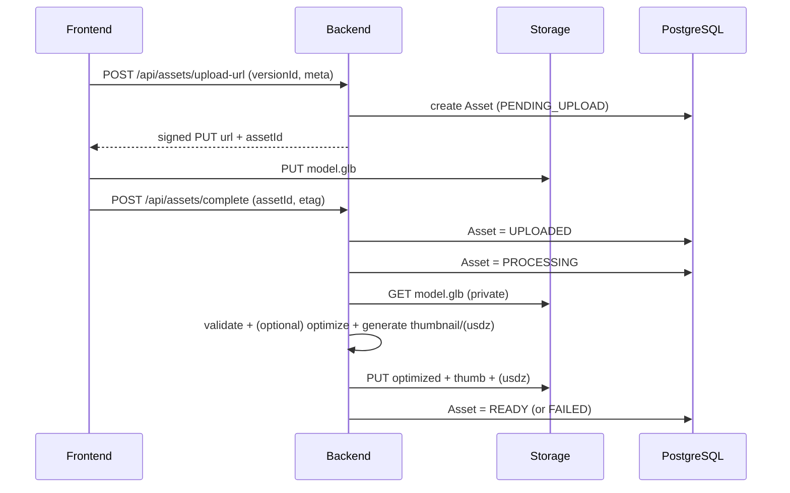
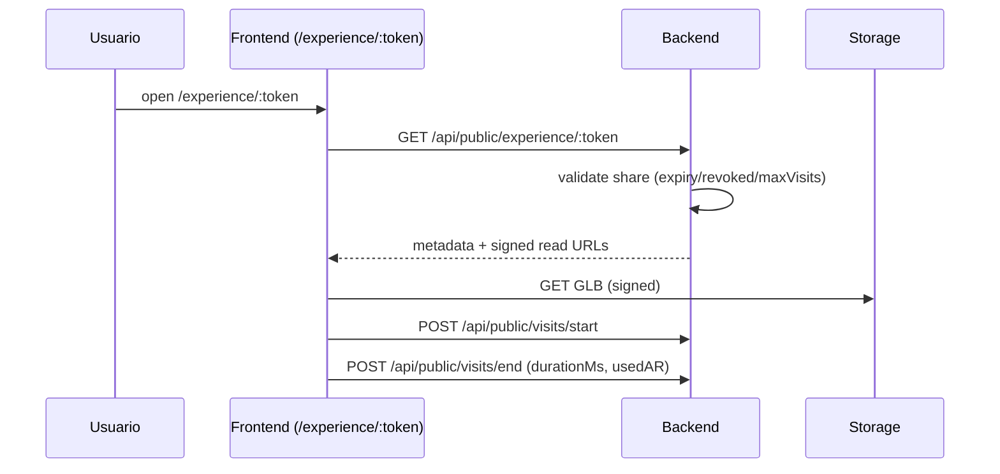
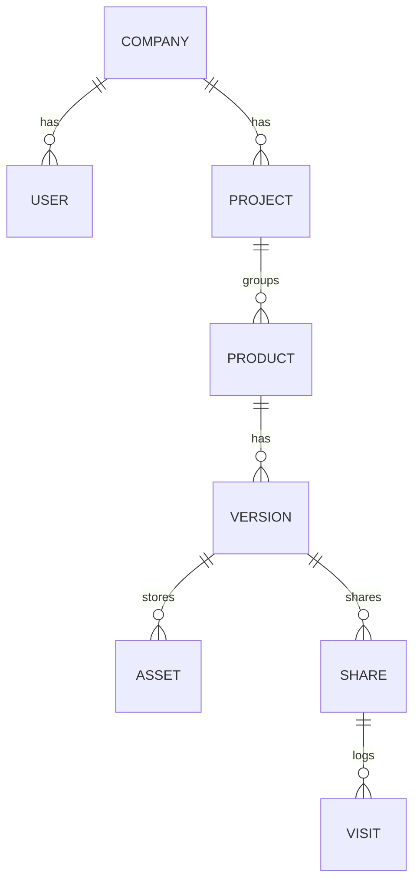

~~~md
# Diagramas Mermaid (source of truth visual)

---

## 1) Arquitectura general (solo FE + BE + DB)
```mermaid
flowchart LR
  U[Usuario Mobile/Desktop] --> FE[Frontend Next.js]
  FE -->|REST JSON| BE[Backend Express]
  BE --> DB[(PostgreSQL)]
  BE --> ST[(Object Storage - assets privados)]
  FE -->|URLs firmadas (read)| ST
```

---

## 2) Secuencia: Upload (Signed URL) + Procesamiento en Backend (KISS)


---

## 3) Secuencia: Experiencia pública (Share)


---

## 4) ER Diagram (alto nivel)

```